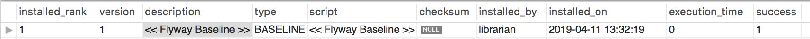

# Database as Code
This application is a tangible example of how to manage an application's database schema along side the code for the application. Since the luxury of starting a new project with a new database is the exception rather than the norm, this exercise exemplifies how to start implementing database as code with an existing database.   

# Motivation
If you can check database changes into your source repository, you can automate database changes. This also allows an orchestration tool in the pipeline to “call” those scripts to make the changes to the database.

# Bookstore
Bookstore is a theoretical whitelabel application for small book store owners to manage their inventory. 

# Use Case
We have been tasked with making changes to the database schema Bookstore is coupled to.

# Goals
1. Add new reference data (columns, keys, constraints, indices, etc...).
2. Refactor the schema.
3. Don't break anything!  

# Prerequisites

1. Java 8+
2. Maven 2+
3. To reduce boilerplate code when creating pojos and entities, we use Lombok
    - https://projectlombok.org/
    - Setup on Eclipse: https://projectlombok.org/setup/eclipse
    - Setup on Intellij: https://projectlombok.org/setup/intellij
    - 

4. MySQL 8+
    - Before launching this application, ensure you have a locally running instance of MySQL
    - Create the user
        ```mysql
           CREATE USER 'librarian'@'localhost' IDENTIFIED BY 'b00k5RC00l';
           GRANT ALL PRIVILEGES ON *.* TO 'librarian'@'localhost' WITH GRANT OPTION;
    
        ```
    - Create the database
        ```mysql
        CREATE DATABASE `bookstore`;
        ```
    - Create the table
        ```mysql
          CREATE TABLE `bookstore`.`book` 
            (
              `id` bigint(20) NOT NULL AUTO_INCREMENT, 
              `title` varchar(128) NOT NULL,
              `author` varchar(45) NOT NULL,
              `price` float NOT NULL, PRIMARY KEY (`id`),
              UNIQUE KEY `id_UNIQUE` (`id`),
              UNIQUE KEY `title_UNIQUE` (`title`)) ENGINE=InnoDB;

        ```
    - Seed the database
        ```mysql
          INSERT INTO `bookstore`.`book`
            (`title`,`author`,`price`)
          VALUES
            ('Red Rising','Pierce Brown',9.94),
            ('Golden Son','Pierce Brown',13.78),
            ('Morning Star','Pierce Brown',10.87),
            ('Iron Gold','Pierce Brown',19.04),
            ('Dark Age','Pierce Brown',19.71);
        ``` 
 
# Migration Tool
We will use [flyway](https://flywaydb.org/) to automate the version management of our db schema

# Steps
We will implement Database as Code in the following sequence

1. Take a baseline of the existing db schema

    1.1 Export the existing db schema to a file named `src/main/resources/db/migration/V1__Base_version.sql`
    
    1.2 This is an example of using MySQLWorkbench to forward engineer our existing db schema 
            
    1.3 Create `FlywayConfig.java` (see source code)
    
    1.4 Update `DaasApplication.java` (see source code)
    
    1.5 Startup DAAS
    
    1.6 Verify baseline was successful
    
      1.6.1 new table `bookstore.flyway_schema_history`
        
      1.6.2 One record 
        
2. Write a failing test case

3. Create a schema migration script

4. Make the corresponding change in the application code base

5. Run tests

6. Migrate db and deploy application (locally)

# Coming soon...
In the near future we will build a docker image with java and mysql so we can remove those prerequisites. 
